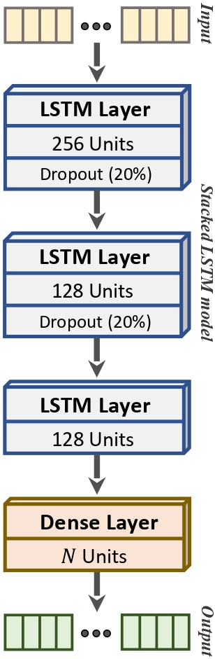
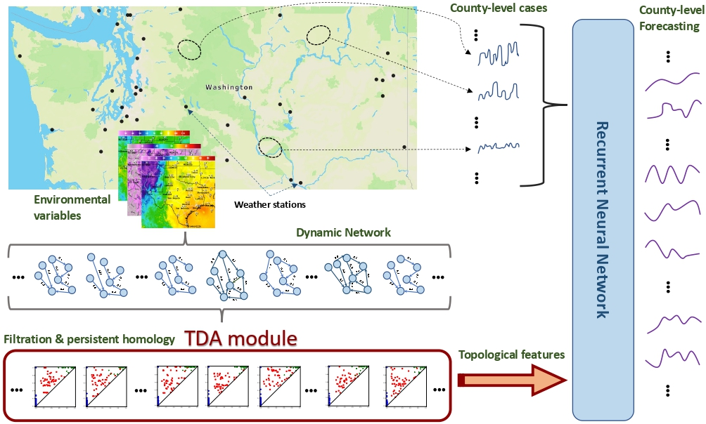

# Covid-19 Forecasting via Deep Learning and Topological Data Analysis

Our proposed methodology has two main modules, see the graphical workflow in the below Figure:

   
  
   
  
  <b>(a)
  
  <b>(b)</b>

Topological LSTM (a) RNN architecture. (b) Our proposed methodology

This package includes the source codes and datasets used in this research project. We encourage the reader to review the submitted paper: Covid-19 Forecasting via Deep Learning and Topological Data Analysis, and its Supplementary material.

Codes: The full set of script files used in this research paper.
ReduceDataset: The reduced dynamic network used through this research.
PersistenceDiagrams: All persistence diagrams obtained via Clique Community Persistence.
Competitors: The competitor's source code used to contrast our methodology.
